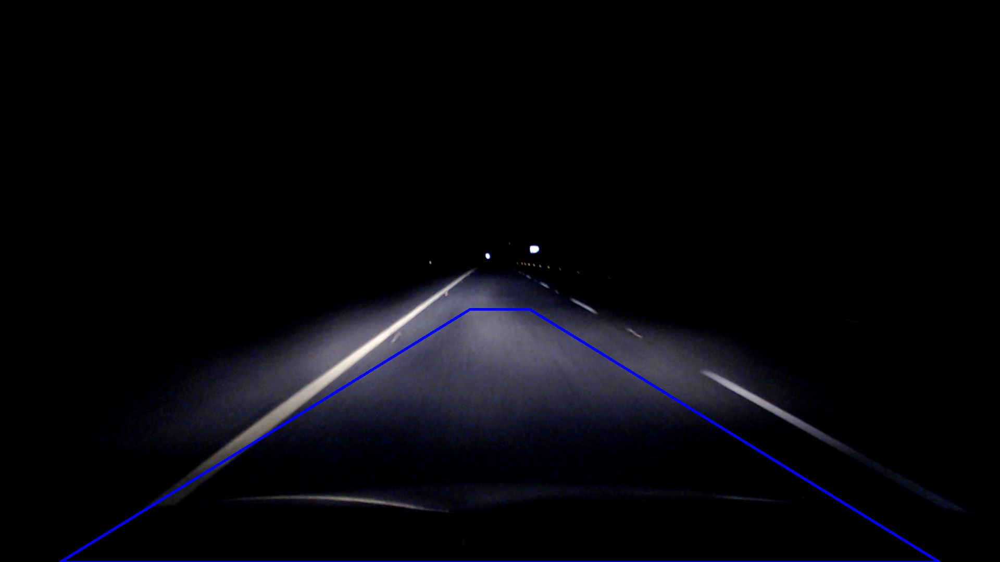
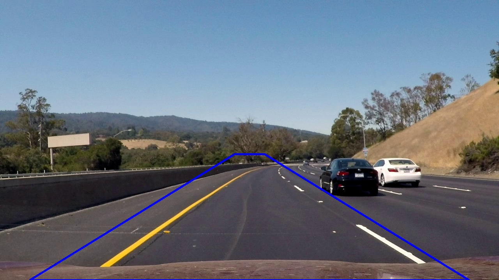
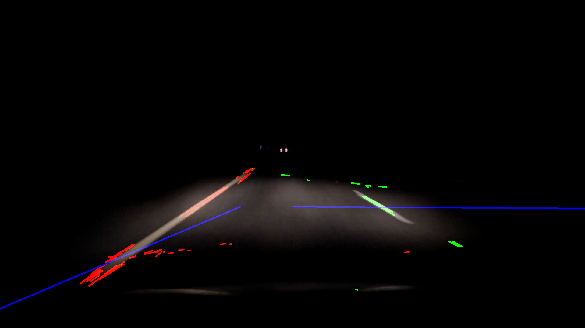
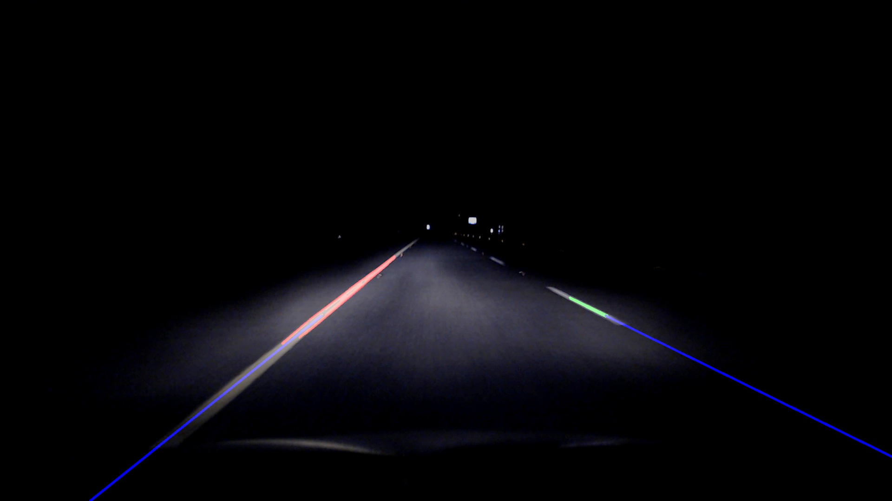

# LaneLines
Udacity Self Driving Car Nanodegree, Term 1, Project 1

### Reflection

### 1. Describe your pipeline. As part of the description, explain how you modified the draw_lines() function.

My pipeline consisted of 5 steps. First, I extracted a region of interest from the frame, this can be assumed to be a trapezoid shape that tapers in width from bottom to top as due to the perspective effect of the road lines from a distance approaching the camera mounted on the vehicle. The benefit of extracting a region of interest is reducing the overhead of processing on the rest of the pipeline as over half of the image is already disregarded.

Next I extracted segments of the image that matched the color of road lines that we were concerned with. These colors being yellow and white. By using a thresholding function I selected lower and upper bounds in RGB space that white and yellow would lie in. After experimenting with HSV and HLS color spaces I found thresholding on the HLS color space to be the most effective. 

As a result of thresholding my pipeline outputs two binary images, one of the thresholded white values, the other with the thresholded yellow values. By using the bitwise OR operater these two images are fused together into one binary image.

The binary image is then run through a gaussian filter to smooth the image. This smoothed image can then be run through the canny edge detector which...

This is then run through Hough...

In order to draw a single line on the left and right lanes, I iterate through each of the lines returned by the HoughLines function. Firstly I check the slope of the line, if the slope is positive the line is sloping from left to right and hence can be classed as a line on left lane, likewise if the line has a negative slope it can be classed as a line on the right lane. Horizontal lines are ignored in this algorithm. Left lane lines are pooled together as are right lane lines. Using the numpy polyfit funciton I then get the function of the best fitting line to the lines that were input to the polyfit function (show function of line here...). Lastly I take two points Y points on the line and input Y into the equation of the line to get its corresponding X coordinate. These X and Y coordinates are what I draw in the resulting image. 

### 2. Identify potential shortcomings with your current pipeline

Further testing was run by mounting a camera on my personal vehicle and running the pipeline live by capturing the video steam with OpenCV VideoCapture functions. However, this showed many flaws in the current implementation. The first of these flaws was the region of interest that was selected for the sample images and video did not match the region of interest required for the new camera / vehicle combination.

This was corrected to allow the new camera / vehicle combination to include the lane lines within its region of interest.

The pipeline was then tested at night, with the current canny and hough parameters the resulting detected lines included alot of noise due to artificial lights reflecting off surfaces.

The canny and hough parameters were adjusted to account for this, however I could not clean up the images completely and lines were still skewed.

Lastly, the pipeline only maps lane lines to straight lines and not curved lines.

### 3. Suggest possible improvements to your pipeline

Different cameras and vehicles could have different profiles that are loaded at pipeline initialisation time, this would allow the same pipeline to run with the same behaviour across a variety of condiitons by taking varying parameters from the vehicle/camera profiles

Thresholds could be adapted to lighting conditions to make the pipeline suitable for all lighting conditions at any time of the day in multiple weather conditions

Lines could be fittes to a polynomial function rather than a linear function allowing the detected lines to be mapped to curves and straight lines rather than being limited to straight lines
